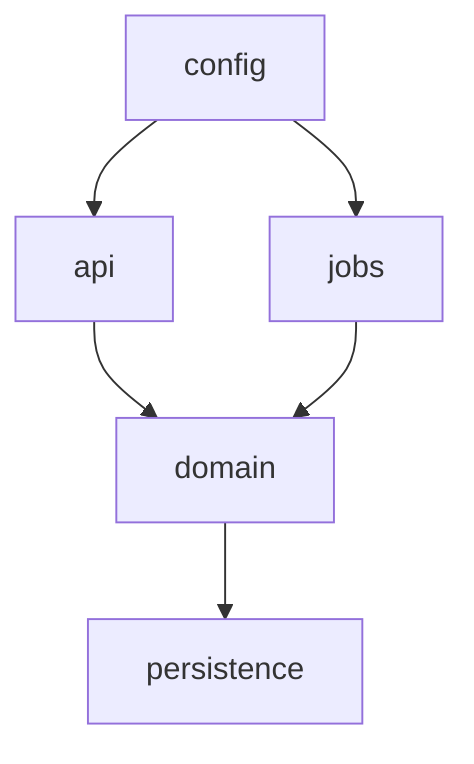

# Architecture Map

The first onboarding deliverable: what the repo contains and how the pieces fit.

## Method

1. Read docs first (`README`, `AGENTS.md`, `CLAUDE.md`, `docs/`, `CONTRIBUTING`, ADRs). Treat them as claims to verify, not facts.
2. Confirm each claim against code. Where docs and code disagree, report the code and flag the drift.
3. For large repos, map structure before reading individual files. If the `cartog` plugin is installed, use `cartog_map` and `cartog_search` to speed up the sweep; otherwise fall back to Glob/Grep over the tree. cartog is an optional accelerator, never required.

## Required Output

### Top-level architecture

List each app / service / library and one line on what it does. Cite the manifest or entry point (`package.json`, `Cargo.toml`, `pyproject.toml`, `go.mod`, `main.*`).

### Directory map

Top ~10 directories, each with its responsibility and a citing example file.

| Directory | Responsibility | Evidence |
|-----------|----------------|----------|
| `src/api/` | HTTP route handlers | `src/api/routes.ts:12` registers the router |

### Runtime boundaries

Identify and cite each boundary that exists (omit those that don't):

- **API layer** — entry points, route registration.
- **Domain layer** — core business logic, independent of I/O.
- **Persistence** — DB access, repositories, ORM models, migrations.
- **Async jobs** — workers, queues, schedulers, cron.
- **Config** — env loading, settings, secrets handling.

### Dependency diagram

A Mermaid diagram using the repo's **actual** module/package boundaries (not idealized layers). Direction = depends-on.

### Monorepo setup (if applicable)

If the repo is a monorepo, explain the workspace and tooling setup: workspace manifest (`pnpm-workspace.yaml`, `turbo.json`, `nx.json`, Cargo workspace, Go modules), how packages reference each other, and the build/task runner. Cite the config files.

## Rules

- Every claim names a file + brief evidence.
- Draw boundaries from real imports/dependencies, not from what the layers "should" be.
- If a boundary is absent (e.g. no domain layer — logic lives in controllers), say so explicitly; it's useful onboarding signal.
