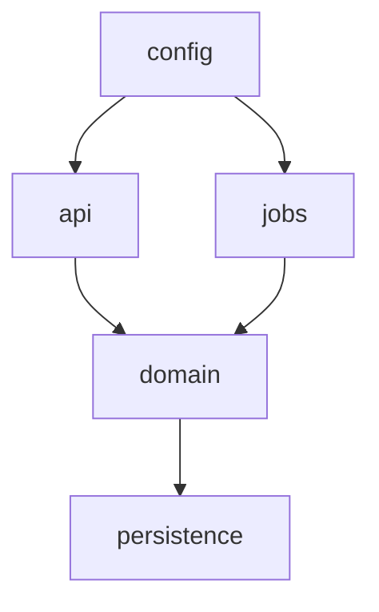

# Architecture Map

The architecture-map deliverable: what the repo contains and how the pieces fit.

## Method

1. Read docs first (`README`, `AGENTS.md`, `CLAUDE.md`, `docs/`, `CONTRIBUTING`, ADRs). Treat them as claims to verify, not facts.
2. Confirm each claim against code. Where docs and code disagree, report the code and flag the drift.
3. For large repos, map structure before reading individual files. If the `cartog` plugin is installed, use `cartog_map` and `cartog_search` to speed up the sweep; otherwise fall back to Glob/Grep over the tree. cartog is an optional accelerator, never required.

## Required Output

> Order matters: state **what the repo is** (top-level architecture) before classifying *how* it's built (pattern, tech decisions). A reader orients on purpose first.

### Top-level architecture

One-paragraph purpose, then each app / service / library and one line on what it does. Cite the manifest or entry point (`package.json`, `Cargo.toml`, `pyproject.toml`, `go.mod`, `main.*`).

### Architecture pattern

Name the pattern(s) **this repo actually uses**, each backed by structural evidence — not by what a framework's marketing calls itself. This is detection, not recommendation: identify the choice the codebase made and cite where it shows.

A repo usually combines styles (e.g. a Clean-Architecture service that is event-driven at the edges and sits behind an API gateway). Name the **primary** one, note **secondaries**, and keep two axes separate because they are orthogonal:

- **Deployment shape** — Monolithic / Modular Monolith / Microservices (how many independently deployed units).
- **Internal style** — Layered, Hexagonal, Clean, Event-Driven, CQRS, Event Sourcing, API Gateway (how the code is organized within a unit).

Match against this catalog. Each card: what it is → tell-tale evidence to detect it → counter-evidence (what would mean it's *not* this).

#### Monolithic Architecture
One deployable containing all features. **Detect:** single entry point, one build artifact, one deploy unit, shared in-process calls. **Not this:** multiple `serverless`/`Dockerfile`/service manifests deployed separately.

#### Modular Monolith
One deployable, but strong internal module boundaries. **Detect:** workspace packages or enforced import rules; modules communicate through explicit interfaces, not reach-through. **Not this:** any module freely importing another's internals.

#### Microservices Architecture
Many independently deployed services collaborating over the network. **Detect:** multiple service manifests, per-service pipelines/datastores, cross-service calls via HTTP/queue/gRPC. **Not this:** "services" that are really in-process modules of one deployable.

#### Event-Driven Architecture
Components react to events asynchronously. **Detect:** queues/streams/topics (SQS, Kafka, DynamoDB Streams, EventBridge), publishers + subscribers, handlers keyed by event type. **Not this:** only synchronous request/response.

#### CQRS (Command Query Responsibility Segregation)
Separate write and read models. **Detect:** distinct command vs query paths, often different stores or denormalized read models; writers and readers don't share the same model. **Not this:** one model serving both reads and writes.

#### Event Sourcing
An append-only event log is the source of truth; state is rebuilt by replay. **Detect:** an immutable event store, projections/replay logic, no in-place row updates for the aggregate. **Not this:** current-state rows mutated directly (even if domain events are also emitted).

#### Hexagonal Architecture (Ports & Adapters)
A domain core isolated behind ports, with adapters on the outside. **Detect:** explicit `port` interfaces/traits and `adapter` implementations; infra depends on the domain, never the reverse. **Not this:** domain code importing a DB driver, HTTP client, or SDK directly.

#### Clean Architecture
Concentric layers with dependency inversion toward the center. **Detect:** use-cases/interactors depending on abstractions; entities free of frameworks; outer layers (controllers, gateways) depend inward. **Not this:** entities importing frameworks, or use-cases importing concrete infra.

#### API Gateway Pattern
A single entry point fronts and routes to backend handlers. **Detect:** an API Gateway / BFF / reverse-proxy layer doing auth, routing, rate-limiting in front of functions or services. **Not this:** clients calling each backend directly with no fronting layer.

Cite the evidence for every pattern claimed (directory names, base classes/traits/interfaces, import direction, trigger types, gateway/IaC config, workspace manifests) — one or two sentences each. If the code matches no card cleanly, say "no single dominant pattern — \<describe what's actually there\>"; an honest "mixed / ad-hoc" beats a forced label.

### Tech decisions observed

The notable technology choices the repo has **already made**, each with where it's visible. Describe the choice, not whether it was right (no recommendations). Cover those that apply; omit the rest.

| Decision | What to report | Where it shows |
|----------|----------------|----------------|
| **Database** | engine(s) and why-shaped (relational / document / KV / search / time-series) | ORM/driver dep, connection config, migrations, schema/entity files |
| **Caching** | cache layer if any (in-memory, Redis, CDN, HTTP cache headers) and what it fronts | cache client dep, cache-aside code, TTL config |
| **Message queue / streaming** | broker/stream used (SQS, Kafka, RabbitMQ, EventBridge, Kinesis) and sync-vs-async boundaries | IaC queue/stream defs, consumer/producer code |
| **Authentication** | how callers prove identity (session, JWT, API key, OAuth/OIDC, mTLS, upstream authorizer) | auth middleware/guard/authorizer config |
| **Frontend framework** | framework + rendering model (React/Vue/Svelte/Angular; SPA/SSR/SSG) — only if a frontend exists | `package.json` deps, build config, app entry |
| **Cloud provider** | AWS / GCP / Azure / multi / none, and managed-service reliance | IaC provider block, SDK packages |
| **API style** | REST / GraphQL / gRPC / RPC / event-only | route definitions, schema/IDL files, server setup |

Cross-reference the cloud-architecture and security deliverables rather than repeating their detail here; this subsection is the one-glance "what stack decisions were made" summary.

### Directory map

Top ~10 directories, each with its responsibility and a citing example file.

| Directory | Responsibility | Evidence |
|-----------|----------------|----------|
| `src/api/` | HTTP route handlers | `src/api/routes.ts:12` registers the router |

### Runtime boundaries

Identify and cite each boundary that exists (omit those that don't):

- **API layer** — entry points, route registration.
- **Domain layer** — core business logic, independent of I/O.
- **Persistence** — DB access, repositories, ORM models, migrations.
- **Async jobs** — workers, queues, schedulers, cron.
- **Config** — env loading, settings, secrets handling.

### Dependency diagram

A Mermaid diagram using the repo's **actual** module/package boundaries (not idealized layers). Direction = depends-on.

### Cloud-native repos (if applicable)

If the repo deploys via IaC (serverless, SAM, CDK, Terraform), containers, or heavy cloud-SDK use, the diagram above covers only the application code. The deployment model, function triggers, and managed-service dependencies are a separate deliverable — see `cloud-architecture.md`. Note here that it applies and defer the detail to that section.

### Monorepo setup (if applicable)

If the repo is a monorepo, explain the workspace and tooling setup: workspace manifest (`pnpm-workspace.yaml`, `turbo.json`, `nx.json`, Cargo workspace, Go modules), how packages reference each other, and the build/task runner. Cite the config files.

## Rules

- Every claim names a file + brief evidence.
- Name the architecture pattern from structural evidence (import direction, dir layout, triggers, deploy units), never from a framework's self-description. "Mixed / ad-hoc" is a valid, honest answer.
- Keep deployment shape (monolith vs microservices) separate from internal style (layered, hexagonal, CQRS…) — they are orthogonal.
- Draw boundaries from real imports/dependencies, not from what the layers "should" be.
- If a boundary is absent (e.g. no domain layer — logic lives in controllers), say so explicitly; it's useful onboarding signal.
