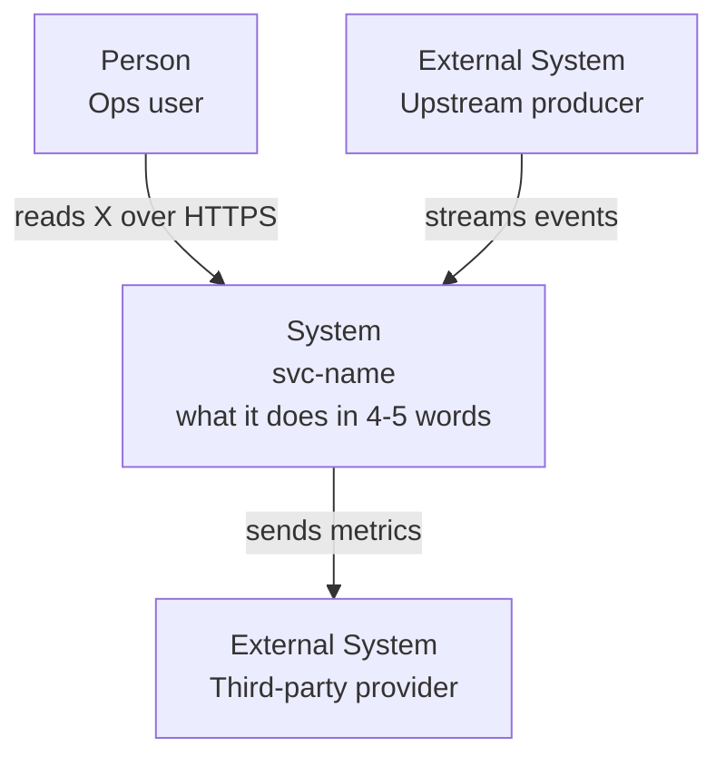
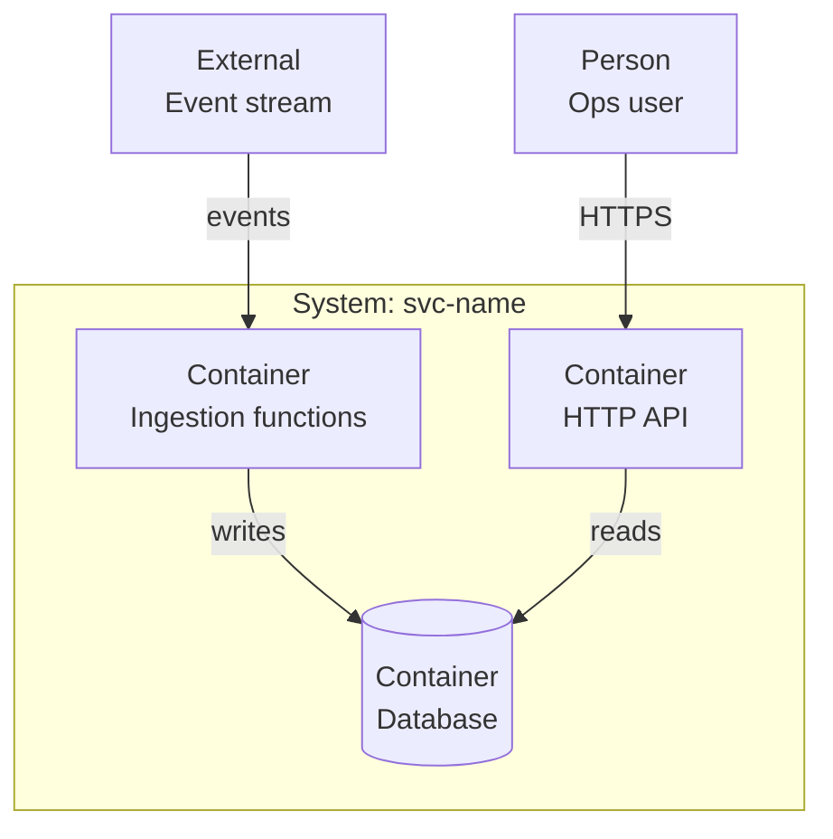
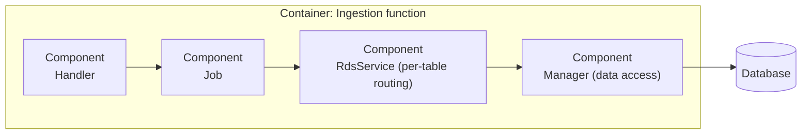
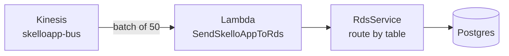
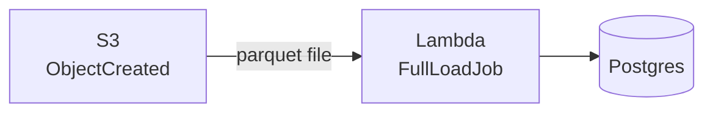

# Big Picture

The deliverable that makes a new dev *see* the system before reading a line of it. Diagrams lead; prose follows. Built with the C4 model (Context → Container → optional Component) plus event-reaction flows for anything async.

> **Diagrams first, always.** A reader scans the C4 diagrams and the event flows, then reads short bullets. The one exception is the single-sentence pattern label that opens this section (it frames the diagrams that follow); everything after it leads with its diagram. Never open with a directory table or a code walk — that is `navigation.md`, and it comes later.

## Method

1. Read docs first (`README`, `AGENTS.md`, `CLAUDE.md`, `docs/`, ADRs) as claims to verify, then confirm against code.
2. Map structure before reading files. If the `cartog` plugin is installed, use `cartog_map`/`cartog_search`; otherwise Glob/Grep the tree. cartog is an optional accelerator, never required.
3. Identify the **actors** (who/what calls the system), the **external systems** (what it depends on that it does not own), and the **containers** (independently runnable/deployable units inside it: an API, a set of ingestion functions, a database, a queue).
4. For each async entry point (queue, stream, schedule, object event), trace the reaction: trigger → handler → downstream. Each becomes an event-flow diagram.

## Required Output

Produce these in order: pattern label (one line) → C4 L1 → C4 L2 → optional C4 L3 → event-reaction flows.

### Architecture pattern (one line, then move on)

Name the primary pattern from **structural evidence**, note secondaries, keep two axes separate:

- **Deployment shape** — Monolithic / Modular Monolith / Microservices (how many independently deployed units).
- **Internal style** — Layered / Hexagonal / Clean / Event-Driven / CQRS / Event Sourcing / API Gateway (how code is organized within a unit).

One or two sentences, cited. This is detection, not the whole section — the diagrams below carry the weight. Detection cues:

- **Event-Driven** — queues/streams/topics with publishers + subscribers, handlers keyed by event type.
- **Clean / Layered** — a one-way call chain (handler → controller → service → repository), inner layers framework-free.
- **Hexagonal** — explicit `port` interfaces + `adapter` implementations; infra depends on domain, never the reverse.
- **Microservices** — multiple service manifests, per-service pipelines/datastores, network calls between them.
- **API Gateway** — a single fronting layer (gateway/BFF) doing auth + routing ahead of the backends.

If nothing fits cleanly, say "mixed / ad-hoc — \<what's actually there\>". An honest label beats a forced one.

### C4 Level 1 — System Context (always)

The 10,000-foot view: **the system as one box**, the people who use it, and the external systems it talks to. No internals. Answers "who uses this and what does it depend on?".

Render as a Mermaid **flowchart styled as C4** (robust everywhere; do not rely on native `C4Context` syntax). Convention: label each node with its C4 kind — `Person:`, `System:` (the one we're onboarding), `External:` (owned by someone else).

Then 2–4 bullets: who each actor is, what each external system is, and — for each external edge — **owned or not owned** (an external system is a contract this repo does not control).

### C4 Level 2 — Container (always)

Zoom into the system box: the **containers** inside it and how they interact. A container is a separately runnable/deployable thing — an API process, a group of ingestion functions, a database, a queue, a cache. Not classes; not layers.

Then a short table — one row per container — with a **why/responsibility column** (a container list without responsibilities is not onboarding):

| Container | Responsibility | Tech | Evidence |
|-----------|----------------|------|----------|
| HTTP API | serve KPI reads | Lambda + API GW | `serverless.ts:227` |
| Ingestion | replay CDC into the DB | Lambda (stream-triggered) | `serverless.ts:315` |
| Database | system of record for mirrored data | Postgres/TypeORM | `ormconfig.js:17` |

### C4 Level 3 — Component (only when a container is complex)

Produce an L3 diagram **only** for a container whose internal structure a new dev must understand to be productive (e.g. an ingestion Lambda with a Handler → Job → RdsService → Manager chain). Skip it for simple containers. When you do produce it, zoom into **one** container and show its internal components (the code-level modules/layers) and their call direction. Say which container it expands.

State explicitly when you skip L3: "L3 omitted — no single container is complex enough to need it."

### Event-reaction flows (one per trigger type)

For **each** async entry point, a small diagram showing the reaction: what fires it → which unit handles it → what it does downstream. One diagram per trigger *type* (CDC stream, object event, queue consumer, schedule), not one giant combined graph. This is the section that makes "listening to Kinesis triggers a Lambda", "a message on SQS is consumed", etc. explicit.

For each flow, give the diagram then a one-line caption naming the **trigger** and the **effect**.

*Trigger: CDC records on the Kinesis stream → replayed as idempotent upserts into Postgres.*

*Trigger: a full-load parquet file lands in S3 → bulk-loaded (one-off migration path).*

Sequence diagrams are an acceptable alternative when message **ordering over time** is the point (e.g. a retry/DLQ path). Use whichever reads clearer; keep one flow per trigger type.

For each flow, also note in a bullet: batch size, retries, and DLQ if declared (`trigger config in the IaC`). A **disposable / one-off** trigger (e.g. a migration path) still gets its own flow diagram, but tag it as disposable in the caption — the same flag the Deploying-It function inventory uses, so the two sections stay consistent. Skip this whole subsection for a repo with no async triggers (state "no async triggers — synchronous request/response only").

## Rules

- **Diagrams before prose.** Every subsection leads with its diagram; bullets/tables explain it. No opening wall of text, no leading directory table.
- Label every C4 node with its kind (`Person` / `System` / `External` / `Container` / `Component`) so the level is unambiguous.
- L1 and L2 always; L3 only for a genuinely complex container (say so when skipped).
- One event-flow diagram per trigger type, to make async reactions explicit, never buried in prose.
- Every claim names a file + brief evidence. Draw boundaries from real imports/triggers, not idealized layers.
- Describe, don't recommend. Name the choices the repo made; do not suggest changes.
- **No em-dash in the output.** Never emit the `—` character. Break ideas with a newline, comma, colon, parentheses, or period.
- **Let it breathe.** Put a blank line between each diagram and its explanation, and between subsections. Short paragraphs over one giant bullet list where the content is narrative.
- **Markdown/Mermaid safety.** No raw `<...>` outside code spans (wrap in backticks). In Mermaid labels use ` ` for line breaks, never `\n`, and no angle-bracket tags (no `<i>`, `<b>` — they don't render). Parentheses inside a quoted `"..."` label are fine (`"RdsService (per-table routing)"`); keep every label quoted.
