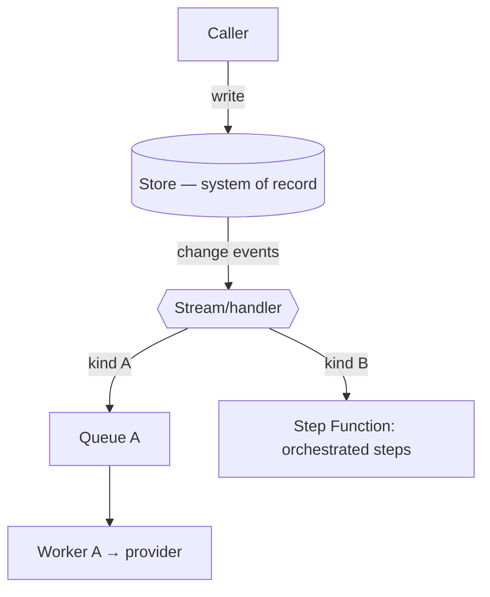
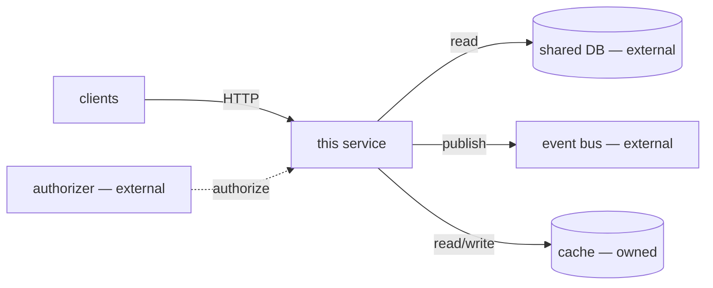

# Cloud Architecture

A conditional onboarding deliverable for repos whose architecture lives partly in **infrastructure-as-code and managed services**, not just in application code. For a serverless or cloud-native service, the internal-module diagram (see `architecture-map.md`) describes a fraction of the system: the rest is the deployment model, the event wiring, and the managed dependencies. This reference captures that rest.

## When this applies

Produce this section only when the repo is cloud-native. Detect it from files, not assumption:

- **IaC manifests**: `serverless.yml` / `serverless.ts`, `template.yaml` (SAM), `cdk.json` / `*Stack.ts`, `*.tf` / `*.tf.json` (Terraform), `pulumi.*`, `main.bicep` (Azure), `app.yaml` (App Engine).
- **Container/orchestration**: `Dockerfile` + `k8s/` / `*.yaml` manifests, `helm/`, `kustomization.yaml`, `skaffold.yaml`, `docker-compose.yml` used as the deploy unit.
- **Cloud SDK usage**: heavy `@aws-sdk/*` / `boto3` / `google-cloud-*` / `@azure/*` imports.

If none are present, skip this section — the repo runs as a plain local process and the four core deliverables cover it.

## Method

1. Read the IaC manifest(s) first — they are the source of truth for the deployed architecture, the way `README` is for intent.
2. Confirm against application code: a manifest may declare a queue or table the code never touches (dead infra), or code may call a service the manifest doesn't provision (out-of-band dependency). Report both.
3. Treat every managed-service dependency as a contract the repo does not own (another team's database, a shared bus, a third-party API). Name it as a boundary.

## Required Output

### Deployment model

One line naming how this ships, cited to the manifest:

- **Functions** (Lambda / Cloud Functions / Azure Functions): list each function and its purpose.
- **Containers** (ECS/Fargate, Cloud Run, AKS/GKE/EKS): the service(s) and their entry image.
- **Other** (static site, managed PaaS): name it.

Cite the IaC file and the tool/version (e.g. `serverless.ts` → Serverless Framework v3; `template.yaml` → SAM; `*.tf` → Terraform).

### Runtime flow

If the system is a pipeline (event-driven, staged, or fan-out), show **how one request/message moves through it** — a **flow diagram plus a short numbered walkthrough**, not an inline arrow-chain. A sentence like `API → DynamoDB → Streams → SQS → Lambda → provider, with a Step Function for X and SNS→SQS for Y` is unreadable; render that as:

Then 3–6 numbered steps, one per hop, each naming the trigger and what happens (Write → Fan-out → Send → Orchestrate → Status feedback). Identify the **system of record** and what the **trigger** is (often a DB write via change-streams, not an HTTP call).

Keep this distinct from the managed-service dependency graph below: this is the **lifecycle/flow** view (how a message travels); that one is the **ownership** view (owned vs external). Skip this subsection for non-pipeline services (e.g. a plain request/response read API).

### Function / service inventory and triggers

For each deployed unit, what invokes it. This is the cloud equivalent of "entry points".

| Unit | Trigger | Source | Evidence |
|------|---------|--------|----------|
| `GetShiftMetrics` | HTTP | API Gateway route | `serverless.ts:42` |
| `ProcessEvents` | Queue | SQS `events-{stage}` | `serverless.ts:71` |
| `NightlyRollup` | Schedule | cron `0 2 * * *` | `template.yaml:88` |

Trigger types to look for: **HTTP/API**, **queue** (SQS/Pub-Sub/Service Bus), **stream** (Kinesis/DynamoDB Streams/Kafka), **schedule/cron**, **object event** (S3/GCS), **direct invoke**.

### Managed-service dependency graph

The services the repo *consumes* — the part the internal-module diagram omits. Draw it with the repo as the center node and direction = depends-on. Distinguish **owned** (provisioned by this repo's IaC) from **external** (another service's, or third-party).

For each edge note: owned vs external, and read vs write. An external read is a **read-model coupling** (a schema change upstream can break this repo silently) — flag it.

### Environments / stages

How the repo distinguishes dev / staging / prod, cited to config: stage parameters (`--stage`, `${sls:stage}`), workspace per env (Terraform workspaces), separate accounts/projects, env-suffixed resource names (`table-${stage}`). Note which stage a new dev deploys to safely (usually a sandbox/dev account).

### Configuration & secrets (injected)

Where runtime config and secrets come from and what each is for — a new dev needs this to run anything. Present as a table (the single source of truth; the CI/CD section references it rather than duplicating):

| Env var (injected) | Source | Usage |
|--------------------|--------|-------|
| `SERVICE_API_KEY` | SSM `/${env}/.../API_KEY` | this service's own auth |
| `PROVIDER_TOKEN` | Secrets Manager / Key Vault | call external provider X |

- **Config store**: SSM Parameter Store, GCP Runtime Config, Azure App Configuration, env files.
- **Secrets**: Secrets Manager, GCP Secret Manager, Key Vault, sealed secrets. Note rotation if declared.
- Cite the IaC reference or the code that reads each (e.g. `EnvVarsHelper`, `getParameter`, `process.env`); mark non-secret runtime vars separately from secrets.

Never print secret values — names, sources, and usage only.

### Observability

Where a new dev looks when it breaks, cited to config:

- **Logs** — CloudWatch Logs / Cloud Logging / App Insights; note retention if set.
- **Traces** — X-Ray / OpenTelemetry / Datadog APM; whether tracing is enabled.
- **Metrics / alarms** — what's alarmed (error rate, latency, DLQ depth) if declared in IaC.

## Rules

- Every claim names a file + brief evidence — same standard as the rest of onboarding.
- Architecture comes from the IaC manifest, confirmed against code — not from idealized cloud diagrams.
- Mark each managed dependency **owned** or **external**; an external read/write is a coupling worth flagging.
- Report drift between manifest and code (provisioned-but-unused resources, called-but-unprovisioned services).
- Describe what exists; do not recommend changes (no "migrate to v4", no "add a VPC endpoint"). Recommendations are a separate task (see `spec-create`).
- Never print secret or credential values — names and sources only.
