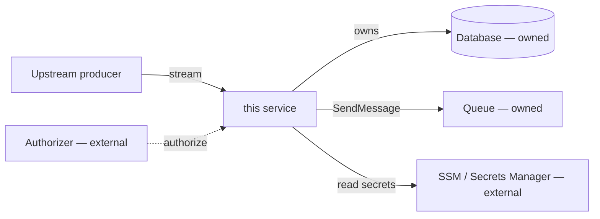

# Deploying It

How the code ships and where it runs. Merges the deployment model, the deployed-unit inventory, the managed-service dependencies, the config/secrets a running instance needs, and the CI/CD path from branch to environment. Describe what exists and cite it; never redesign the pipeline.

## When the cloud detail applies

The **deployment model / function inventory / managed-service graph** subsections apply when the repo is cloud-native. Detect from files, not assumption:

- **IaC**: `serverless.yml`/`serverless.ts`, `template.yaml` (SAM), `cdk.json`/`*Stack.ts`, `*.tf` (Terraform), `pulumi.*`, `main.bicep`, `app.yaml`.
- **Container/orchestration**: `Dockerfile` + `k8s/` / `helm/` / `kustomization.yaml` / `docker-compose.yml` as the deploy unit.
- **Cloud SDK**: heavy `@aws-sdk/*` / `boto3` / `google-cloud-*` / `@azure/*` usage.

If none apply, this section is short: state how the non-cloud artifact ships (published to a registry, a static build, a plain long-running process) and the CI/CD path, then stop. The **CI/CD** subsection applies whenever CI config exists (`.github/workflows/`, `.gitlab-ci.yml`, `Jenkinsfile`, `.circleci/`, etc.); if there is none, say so in one line.

## Method

1. Read the IaC manifest(s) first — the source of truth for the deployed architecture. Then the CI/workflow files — the source of truth for what "shipped" means.
2. Confirm against code: a manifest may declare a queue/table the code never touches (dead infra), or code may call a service the manifest doesn't provision (out-of-band dependency). Report both.
3. Map each pipeline to its trigger (push to branch, PR, tag, manual, schedule) and target environment. Distinguish CI gates from CD deploy steps.
4. Treat every managed-service dependency as a contract the repo does not own — name it as a boundary.

## Required Output

### Deployment model
One line naming how this ships, cited to the manifest and tool/version:

- **Functions** (Lambda / Cloud Functions / Azure Functions) — runtime + arch (e.g. `nodejs20.x`, arm64), framework (Serverless v3, SAM, CDK), region.
- **Containers** (ECS/Fargate, Cloud Run, AKS/GKE/EKS) — the service(s) and entry image.
- **Other** (static site, managed PaaS, npm package) — name it.

### Function / service inventory & triggers *(cloud-native)*
One row per deployed unit: what invokes it, and why it exists. This is the cloud equivalent of "entry points" — and it lines up with the event-reaction flows from Big Picture (reference them, don't redraw).

| Unit | Trigger | Source | Purpose | Evidence |
|------|---------|--------|---------|----------|
| `ApiGetKpis` | HTTP | API GW `GET /kpis` | serve weekly KPIs | `serverless.ts:…` |
| `SendSkelloAppToRds` | Stream | Kinesis `skelloapp-bus` | replay CDC | `serverless.ts:315` |
| `NightlyRollup` | Schedule | cron | rebuild aggregates | `template.yaml:…` |

Trigger types: **HTTP/API**, **queue** (SQS/Pub-Sub/Service Bus), **stream** (Kinesis/DynamoDB Streams/Kafka), **schedule/cron**, **object event** (S3/GCS), **direct invoke**. Flag disposable/one-off units (migration scaffolding) plainly so a new dev doesn't mistake them for core.

### Managed-service dependency graph *(cloud-native)*
The services the repo *consumes* — the ownership view. Repo at the center, direction = depends-on. Distinguish **owned** (provisioned by this repo's IaC) from **external** (another team's, or third-party).

For each edge: owned vs external, read vs write. An **external read is a read-model coupling** (an upstream schema change can break this repo silently) — flag it as a fact.

### Environments / stages
How dev / staging / prod are distinguished, cited: stage params (`--stage`, `${sls:stage}`), separate accounts/projects, env-suffixed resource names, Terraform workspaces. Note which stage a new dev deploys to safely (usually a sandbox/dev account).

### Configuration & secrets (injected)
Where runtime config and secrets come from and what each is for — a running instance needs this. One table, the single source of truth (the security section references it, doesn't duplicate):

| Env var (injected) | Source | Usage |
|--------------------|--------|-------|
| `SERVICE_API_KEY` | SSM `/${env}/…/API_KEY` | this service's own auth |
| `DATABASE_URL` | Secrets Manager (assembled) | primary DB connection |

- **Config store**: SSM / Runtime Config / App Configuration / env files.
- **Secrets**: Secrets Manager / Vault / Key Vault / sealed secrets. Note rotation if declared.
- Cite the IaC ref or the code that reads each (`EnvVarsHelper`, `getParameter`, `process.env`). Mark non-secret runtime vars separately from secrets. **Never print secret values** — names, sources, usage only.

### CI/CD pipelines
One row per workflow: trigger → steps → deploy target → why. A table reads best.

| Workflow | Trigger | Steps | Deploy → env | Purpose |
|----------|---------|-------|--------------|---------|
| `ci.yml` | pull_request | lint → test → build | — | merge gate |
| `deploy-prod.yml` | push `main` | test → build → deploy | production | ship to prod |

- **Branch → environment mapping** — the promotion path in one glance (`sandbox → sdbx`, `staging → stag`, `main/master → prod`). Cite the trigger blocks. Note any env with **no** automated pipeline (manual deploy).
- **Deploy command** — the actual command each pipeline runs, and the local equivalent a dev runs if permitted (cite the script/target). Note who may deploy where and any required role/credential.
- **CI secrets/env** — how the pipeline obtains secrets (CI secret store, OIDC role assumption, fetched from a parameter store at deploy). Reference the config/secrets table above; only note what is CI-specific.
- **Quality gates** — what must pass before merge/deploy (required checks, coverage threshold, approvals, branch protection). Cite the `needs`/`if` wiring or repo settings if visible.

### Observability *(cloud-native)*
Where a new dev looks when it breaks, cited: **Logs** (CloudWatch / Cloud Logging / App Insights; note retention), **Traces** (X-Ray / OpenTelemetry / Datadog APM; whether enabled), **Metrics/alarms** (what's alarmed — error rate, latency, DLQ depth — if declared in IaC).

## Rules

- Every claim names a file + brief evidence.
- Architecture comes from the IaC manifest and workflow files, confirmed against code — not idealized diagrams.
- Mark each managed dependency **owned** or **external**; an external read/write is a coupling worth flagging.
- Report drift honestly (provisioned-but-unused resources, called-but-unprovisioned services, a workflow that lints but never tests, a deploy with no gate) as neutral observations.
- Describe what exists; do not recommend changes (no "migrate to v4", no "add a VPC endpoint", no new pipeline stages).
- Never print secret/credential values — names and sources only.
- Reference the config/secrets table once; don't restate it in CI/CD.
- Markdown/Mermaid safety: no raw `<...>` outside code spans; ` ` (not `\n`) in Mermaid labels.
