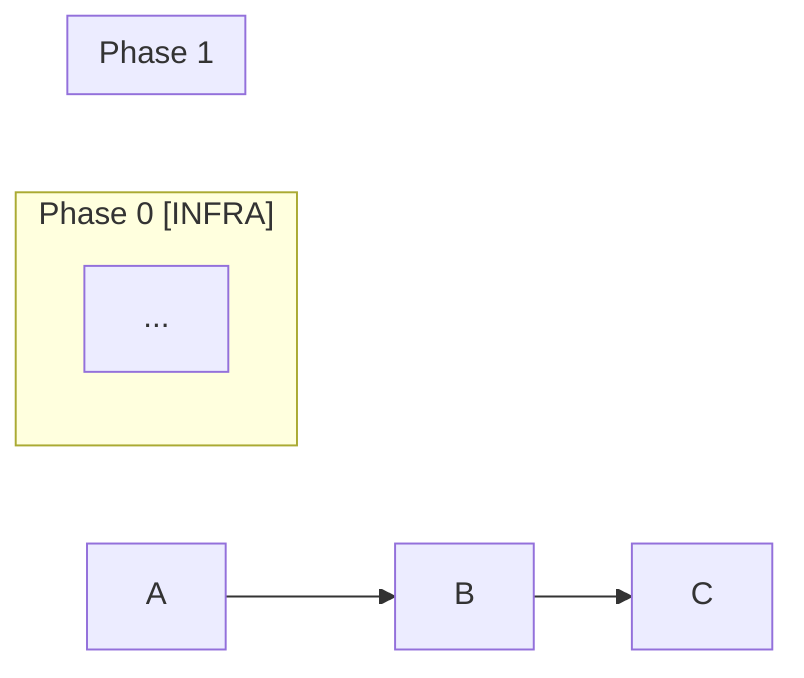
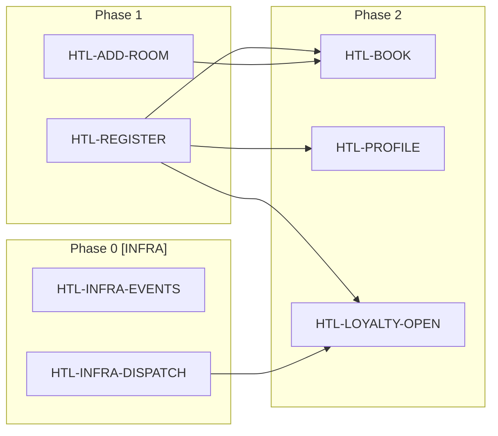

> Reference for: Event Model to Tasks
> Load when: Generating the task file from an event model

# Output Template

The generated task file serves two audiences:
- **Developers** reading it to understand what to build
- **Agents** (spec-impl) consuming it to execute tasks

It must be compatible with spec-create's tasks.md format (table with Status, Refs, Verification, Notes columns) while providing enough event modeling context for someone who hasn't seen the methodology before.

## Two-Level Format

Each task appears twice:
- **Table row** — one-line summary for spec-impl scanning. Verification column = short summary of the primary test.
- **Detailed section** — full context. Build instructions, verbatim acceptance criteria, all verification cases including error/idempotency tests.

The `Blocked by:` field in the Notes column is the **source of truth** for dependencies. The Mermaid graph is generated from it.

**Ordering within a phase:** Commands first, then Views, then Automations.

## Template

````markdown
# <Feature Name> — Tasks (<TRIGRAM>)

## Source

Event model: `<path to event model document>`

## How to Read These Tasks

Each task implements one **slice** from the event model. A slice is the smallest unit of work containing everything needed for implementation.

Tasks come in 4 types based on their **pattern**:

### Command Tasks — "Something changes"

A user or API call triggers a state change.

- **Given** = Preconditions. Your handler must verify these events exist before accepting the command. If missing → reject with error.
- **When** = The command your handler receives. These are the input fields.
- **Then** = The event you must persist when preconditions pass. This shape is a contract — other parts of the system depend on it.

**You build:** API endpoint + command handler + event persistence.
**You test:** (1) Send valid command → event persisted with expected fields. (2) Send command without preconditions → rejected.

### View Tasks — "Someone reads data"

Events are projected into a read-optimized query result.

- **Given** = The event types your projection reads and aggregates.
- **Then** = The query result your endpoint must return.

**You build:** Projection (subscribes to/reads events, maintains read model) + query endpoint.
**You test:** Insert given events → query endpoint → response matches expected.

### Automation Tasks — "System reacts automatically"

A background process monitors a **todo-list** (a special view showing "work to be done") and calls one command per row.

- The **todo-list view** shows unprocessed items (e.g., "payments not yet captured")
- The **robot** reads each row and calls the corresponding command. No business logic — just read and call
- When the command produces its event, the **row disappears** from the todo list. This guarantees idempotency: no row is processed twice.

**You build:** Todo-list projection + robot process + command handler for the produced command.
**You test:** (1) Populate todo → run robot → event produced, row gone. (2) Run robot again → nothing happens.

### Translation Tasks — "External system sends data"

Same as Automation, but the source events come from an external system. Use a stub/mock for the external system in tests.

---

## Phase 0: Infrastructure [INFRA]

| Task | Status | Refs | Verification | Notes |
|------|--------|------|--------------|-------|
| <TRIGRAM>-INFRA-<NAME>: <description> | Not Started | — | <what proves it works> | <context> |

## Phase <N>: <Phase Title>

| Task | Status | Refs | Verification | Notes |
|------|--------|------|--------------|-------|
| <TRIGRAM>-<NAME>: <Slice> (<Pattern>) | Not Started | Slice <ID> | <verification> | <endpoint + blocked by> |

**Detailed specifications:**

### <TRIGRAM>-<NAME>: <Slice Name>
**Pattern:** <Command|View|Automation|Translation> | **Swim Lane:** <domain>

**Build:**
- <what to implement — specific to the pattern>

**Acceptance criteria:**
> Given: <verbatim from event model>
> When: <verbatim from event model>
> Then: <verbatim from event model>

**Verify:**
- ✅ <happy path test>
- ✅ <error case test — preconditions missing, idempotency, etc.>

---

## Dependency Graph



## Summary

- **Trigram:** <XXX>
- **Total tasks:** <N model-derived> + <M infrastructure>
- **Phases:** <count>
- **Swim lanes:** <list>
````

## Key Rules for Generating

1. **Preamble always included** — reproduce the "How to Read These Tasks" section exactly as shown in the template above
2. **Table row per task** — for spec-impl compatibility (it scans for "Not Started"). Verification = one-line test summary
3. **Detailed section per task** — under the table. Build instructions + verbatim acceptance criteria + full verification list
4. **Given-When-Then verbatim** — never paraphrase the event model specifications
5. **Error cases per pattern** — Commands: test precondition rejection. Automations: test idempotency. Views: test empty/missing response
6. **Blocked by is source of truth** — Notes column `Blocked by:` is authoritative. Mermaid graph is generated from it
7. **Order within phases** — Commands first, then Views, then Automations

## Example (abbreviated)

````markdown
# Hotel Booking — Tasks (HTL)

## Source

Event model: `docs/features/hotel-booking/event-model.md`

## How to Read These Tasks
[... preamble as above ...]

## Phase 1: Foundation

| Task | Status | Refs | Verification | Notes |
|------|--------|------|--------------|-------|
| HTL-REGISTER: RegisterGuest (Command) | Not Started | Slice G-1 | Integration test: POST /guests → GuestRegistered persisted | POST /guests |
| HTL-ADD-ROOM: AddRoom (Command) | Not Started | Slice I-1 | Integration test: POST /rooms → RoomAdded persisted | POST /rooms (admin) |

### HTL-REGISTER: RegisterGuest
**Pattern:** Command | **Swim Lane:** Guest

**Build:**
- Command handler for RegisterGuest
- Persist GuestRegistered event
- API: POST /guests

**Acceptance criteria:**
> Given: (no prior events)
> When: RegisterGuest { firstName: "Alice", lastName: "Dupont", email: "alice@example.com" }
> Then: GuestRegistered { guestId: "g-001", firstName: "Alice", lastName: "Dupont", email: "alice@example.com", registeredAt: "..." }

**Verify:**
- ✅ POST /guests with valid data → GuestRegistered persisted with expected fields
- ✅ POST /guests with duplicate email → rejected

### HTL-ADD-ROOM: AddRoom
**Pattern:** Command | **Swim Lane:** Inventory

**Build:**
- Command handler for AddRoom
- Persist RoomAdded event
- API: POST /rooms

**Acceptance criteria:**
> Given: (no prior events)
> When: AddRoom { roomNumber: "204", type: "Double", pricePerNight: 120.00, amenities: ["WiFi", "TV"] }
> Then: RoomAdded { roomId: "r-204", roomNumber: "204", type: "Double", pricePerNight: 120.00, addedAt: "..." }

**Verify:**
- ✅ POST /rooms → RoomAdded persisted with expected fields
- ✅ POST /rooms with duplicate roomNumber → rejected

## Phase 2: Core Booking

| Task | Status | Refs | Verification | Notes |
|------|--------|------|--------------|-------|
| HTL-BOOK: InitiateBooking (Command) | Not Started | Slice B-1 | Integration test: POST /bookings → BookingInitiated persisted | POST /bookings. Blocked by: HTL-REGISTER, HTL-ADD-ROOM |
| HTL-PROFILE: GuestProfile (View) | Not Started | Slice G-2 | Query test: given events → GET /guests/{id} returns expected | GET /guests/{id}. Blocked by: HTL-REGISTER |
| HTL-LOYALTY-OPEN: OpenLoyaltyAccount (Automation) | Not Started | Slice G-3 | E2E: todo populated → robot runs → LoyaltyAccountOpened, row gone | Blocked by: HTL-REGISTER, HTL-INFRA-DISPATCH |

### HTL-BOOK: InitiateBooking
**Pattern:** Command | **Swim Lane:** Booking

**Build:**
- Command handler for InitiateBooking
- Persist BookingInitiated event
- API: POST /bookings

**Acceptance criteria:**
> Given: GuestRegistered { guestId: "g-001" }, RoomAdded { roomId: "r-204", pricePerNight: 120.00 }
> When: InitiateBooking { guestId: "g-001", roomId: "r-204", checkIn: "Mar 10", checkOut: "Mar 12" }
> Then: BookingInitiated { bookingId: "b-9001", guestId: "g-001", roomId: "r-204", totalPrice: 240.00, status: "Pending" }

**Verify:**
- ✅ POST /bookings with valid data → BookingInitiated persisted
- ✅ POST /bookings without GuestRegistered for guestId → rejected
- ✅ POST /bookings without RoomAdded for roomId → rejected

### HTL-LOYALTY-OPEN: OpenLoyaltyAccount
**Pattern:** Automation | **Swim Lane:** Guest

**Build:**
- Todo-list view: GuestsWithoutLoyaltyAccount (GuestRegistered where LoyaltyAccountOpened missing)
- Robot: reads todo rows, calls OpenLoyaltyAccount per row
- Completion: LoyaltyAccountOpened removes row from todo

**Acceptance criteria:**
> Given: Todo view shows [{ guestId: "g-001" }]
> When: Robot calls OpenLoyaltyAccount { guestId: "g-001", tier: "Standard" }
> Then: LoyaltyAccountOpened { guestId: "g-001", accountId: "la-001", tier: "Standard", initialPoints: 0 } — row removed

**Verify:**
- ✅ Populate todo → run robot → LoyaltyAccountOpened persisted, row gone
- ✅ Run robot again → nothing happens (idempotent)

## Dependency Graph



## Summary

- **Trigram:** HTL
- **Total tasks:** 18 model-derived + 2 infrastructure = 20
- **Phases:** 6 (0: infra, 1-5: implementation)
- **Swim lanes:** Guest, Inventory, Booking, Payment, Stay
````
