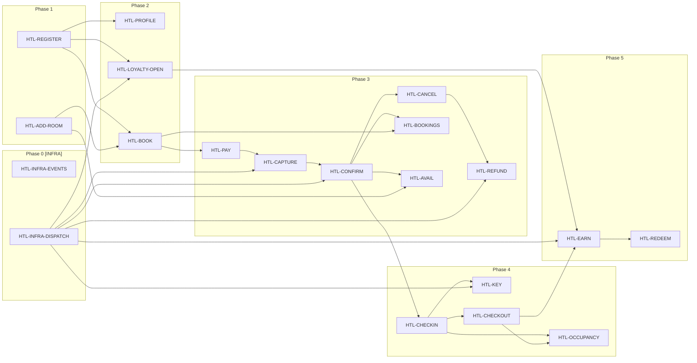

> Reference for: Event Model to Spec
> Load when: Need the full Hotel Booking example with all 18 slices

# Hotel Booking — Tasks (HTL)

## Source

Event model: `docs/features/hotel-booking/event-model.md`

## How to Read These Tasks

Each task implements one **slice** from the event model. A slice is the smallest unit of work containing everything needed for implementation.

Tasks come in 4 types based on their **pattern**:

### Command Tasks — "Something changes"
- **Given** = Preconditions. Verify these events exist before accepting the command. If missing → reject.
- **When** = The command input fields.
- **Then** = The event to persist. This shape is a contract.
- **Build:** API endpoint + command handler + event persistence.
- **Test:** (1) Valid command → event persisted. (2) Missing preconditions → rejected.

### View Tasks — "Someone reads data"
- **Given** = Events your projection reads.
- **Then** = Query result your endpoint must return.
- **Build:** Projection + query endpoint.
- **Test:** Insert given events → query → response matches.

### Automation Tasks — "System reacts automatically"
- A **todo-list view** shows unprocessed items. A **robot** calls one command per row. The produced event **removes the row** (idempotent).
- **Build:** Todo-list projection + robot + command handler.
- **Test:** (1) Populate todo → run robot → event + row gone. (2) Run again → nothing happens.

### Translation Tasks — "External system sends data"
- Same as Automation, source events from external system. Stub in tests.

---

## Phase 0: Infrastructure [INFRA]

| Task | Status | Refs | Verification | Notes |
|------|--------|------|--------------|-------|
| HTL-INFRA-EVENTS: Set up event persistence | Not Started | — | Migration runs, events storable and readable | Event store or append-only table |
| HTL-INFRA-DISPATCH: Set up automation dispatcher | Not Started | — | Dispatcher delivers events to handlers | Needed by all Automation slices |

## Phase 1: Foundation

| Task | Status | Refs | Verification | Notes |
|------|--------|------|--------------|-------|
| HTL-REGISTER: RegisterGuest (Command) | Not Started | Slice G-1 | POST /guests → GuestRegistered persisted | POST /guests |
| HTL-ADD-ROOM: AddRoom (Command) | Not Started | Slice I-1 | POST /rooms → RoomAdded persisted | POST /rooms (admin) |

### HTL-REGISTER: RegisterGuest
**Pattern:** Command | **Swim Lane:** Guest

**Build:**
- Command handler for RegisterGuest
- Persist GuestRegistered event
- API: POST /guests

**Acceptance criteria:**
> Given: (no prior events)
> When: RegisterGuest { firstName: "Alice", lastName: "Dupont", email: "alice@example.com", phone: "+33612345678" }
> Then: GuestRegistered { guestId: "g-001", firstName: "Alice", lastName: "Dupont", email: "alice@example.com", registeredAt: "2026-02-21T09:00:00Z" }

**Verify:**
- ✅ POST with valid data → GuestRegistered persisted
- ✅ POST with duplicate email → rejected

### HTL-ADD-ROOM: AddRoom
**Pattern:** Command | **Swim Lane:** Inventory

**Build:**
- Command handler for AddRoom
- Persist RoomAdded event
- API: POST /rooms

**Acceptance criteria:**
> Given: (no prior events)
> When: AddRoom { roomNumber: "204", type: "Double", pricePerNight: 120.00, amenities: ["WiFi", "TV", "Minibar"] }
> Then: RoomAdded { roomId: "r-204", roomNumber: "204", type: "Double", pricePerNight: 120.00, addedAt: "2026-01-01T08:00:00Z" }

**Verify:**
- ✅ POST with valid data → RoomAdded persisted
- ✅ POST with duplicate roomNumber → rejected

---

## Phase 2: Core Booking + Identity Views

| Task | Status | Refs | Verification | Notes |
|------|--------|------|--------------|-------|
| HTL-PROFILE: GuestProfile (View) | Not Started | Slice G-2 | GET /guests/{id} returns expected profile | Blocked by: HTL-REGISTER |
| HTL-LOYALTY-OPEN: OpenLoyaltyAccount (Automation) | Not Started | Slice G-3 | Todo populated → robot → LoyaltyAccountOpened, row gone | Blocked by: HTL-REGISTER, HTL-INFRA-DISPATCH |
| HTL-BOOK: InitiateBooking (Command) | Not Started | Slice B-1 | POST /bookings → BookingInitiated persisted | Blocked by: HTL-REGISTER, HTL-ADD-ROOM |

### HTL-PROFILE: GuestProfile
**Pattern:** View | **Swim Lane:** Guest

**Build:**
- Projection from: GuestRegistered, LoyaltyPointsEarned, LoyaltyRewardRedeemed
- Query: GET /guests/{guestId}

**Acceptance criteria:**
> Given: GuestRegistered { guestId: "g-001", firstName: "Alice", lastName: "Dupont" }, LoyaltyPointsEarned { guestId: "g-001", points: 350 }
> Then: Profile shows fullName "Alice Dupont", loyaltyPoints 350

**Verify:**
- ✅ Given events → GET /guests/g-001 → { fullName: "Alice Dupont", loyaltyPoints: 350 }
- ✅ No events → GET /guests/g-001 → 404

### HTL-LOYALTY-OPEN: OpenLoyaltyAccount
**Pattern:** Automation | **Swim Lane:** Guest

**Build:**
- Todo-list view: GuestsWithoutLoyaltyAccount (GuestRegistered where LoyaltyAccountOpened missing)
- Robot: reads rows, calls OpenLoyaltyAccount per row
- Completion: LoyaltyAccountOpened removes row

**Acceptance criteria:**
> Given: Todo view shows [{ guestId: "g-001" }]
> When: Robot calls OpenLoyaltyAccount { guestId: "g-001", tier: "Standard" }
> Then: LoyaltyAccountOpened { guestId: "g-001", accountId: "la-001", tier: "Standard", initialPoints: 0 } — row removed

**Verify:**
- ✅ Populate todo → run robot → LoyaltyAccountOpened persisted, row gone
- ✅ Run robot again → nothing happens (idempotent)

### HTL-BOOK: InitiateBooking
**Pattern:** Command | **Swim Lane:** Booking

**Build:**
- Command handler for InitiateBooking
- Persist BookingInitiated event
- API: POST /bookings

**Acceptance criteria:**
> Given: GuestRegistered { guestId: "g-001" }, RoomAdded { roomId: "r-204", pricePerNight: 120.00 }
> When: InitiateBooking { guestId: "g-001", roomId: "r-204", checkIn: "2026-03-10", checkOut: "2026-03-12", guests: 2 }
> Then: BookingInitiated { bookingId: "b-9001", totalPrice: 240.00, status: "Pending" }

**Verify:**
- ✅ POST with valid data → BookingInitiated persisted
- ✅ POST without GuestRegistered → rejected
- ✅ POST without RoomAdded → rejected

---

## Phase 3: Payment + Confirmation

| Task | Status | Refs | Verification | Notes |
|------|--------|------|--------------|-------|
| HTL-PAY: AuthorizePayment (Command) | Not Started | Slice P-1 | POST /payments/authorize → PaymentAuthorized persisted | Blocked by: HTL-BOOK |
| HTL-CAPTURE: CapturePayment (Automation) | Not Started | Slice P-2 | Todo → robot → PaymentCaptured, row gone | Blocked by: HTL-PAY, HTL-INFRA-DISPATCH |
| HTL-CONFIRM: ConfirmBooking (Automation) | Not Started | Slice B-2 | Todo → robot → BookingConfirmed, row gone | Blocked by: HTL-CAPTURE, HTL-INFRA-DISPATCH |
| HTL-CANCEL: CancelBooking (Command) | Not Started | Slice B-3 | DELETE /bookings/{id} → BookingCancelled persisted | Blocked by: HTL-CONFIRM |
| HTL-REFUND: RefundPayment (Automation) | Not Started | Slice P-3 | Todo → robot → PaymentRefunded, row gone | Blocked by: HTL-CANCEL, HTL-INFRA-DISPATCH |
| HTL-BOOKINGS: GuestBookings (View) | Not Started | Slice B-4 | GET /guests/{id}/bookings returns expected list | Blocked by: HTL-BOOK, HTL-CONFIRM |
| HTL-AVAIL: RoomAvailability (View) | Not Started | Slice I-2 | GET /rooms/availability returns filtered rooms | Blocked by: HTL-ADD-ROOM, HTL-CONFIRM |

### HTL-PAY: AuthorizePayment
**Pattern:** Command | **Swim Lane:** Payment

**Build:**
- Command handler for AuthorizePayment
- Persist PaymentAuthorized event
- API: POST /payments/authorize

**Acceptance criteria:**
> Given: BookingInitiated { bookingId: "b-9001", totalPrice: 240.00 }
> When: AuthorizePayment { bookingId: "b-9001", amount: 240.00, currency: "EUR", cardToken: "tok_visa_4242" }
> Then: PaymentAuthorized { paymentId: "pay-7001", bookingId: "b-9001", amount: 240.00, authCode: "AUTH-XYZ" }

**Verify:**
- ✅ POST with valid data → PaymentAuthorized persisted
- ✅ POST without BookingInitiated → rejected

### HTL-CAPTURE: CapturePayment
**Pattern:** Automation | **Swim Lane:** Payment

**Build:**
- Todo-list view: PaymentsToCapture (PaymentAuthorized where PaymentCaptured missing)
- Robot: reads rows, calls CapturePayment per row
- Completion: PaymentCaptured removes row

**Acceptance criteria:**
> Given: Todo view shows [{ paymentId: "pay-7001", bookingId: "b-9001", amount: 240.00 }]
> When: Robot calls CapturePayment { paymentId: "pay-7001" }
> Then: PaymentCaptured { paymentId: "pay-7001", amount: 240.00 } — row removed

**Verify:**
- ✅ Populate todo → run robot → PaymentCaptured persisted, row gone
- ✅ Run again → nothing happens

### HTL-CONFIRM: ConfirmBooking
**Pattern:** Automation | **Swim Lane:** Booking

**Build:**
- Todo-list view: BookingsPendingConfirmation (PaymentCaptured where BookingConfirmed missing)
- Robot: reads rows, calls ConfirmBooking per row
- Completion: BookingConfirmed removes row

**Acceptance criteria:**
> Given: Todo view shows [{ bookingId: "b-9001" }]
> When: Robot calls ConfirmBooking { bookingId: "b-9001" }
> Then: BookingConfirmed { bookingId: "b-9001", confirmedAt: "2026-02-21T10:07:00Z" } — row removed

**Verify:**
- ✅ Populate todo → run robot → BookingConfirmed persisted, row gone
- ✅ Run again → nothing happens

### HTL-CANCEL: CancelBooking
**Pattern:** Command | **Swim Lane:** Booking

**Build:**
- Command handler for CancelBooking
- Persist BookingCancelled event
- API: DELETE /bookings/{bookingId}

**Acceptance criteria:**
> Given: BookingConfirmed { bookingId: "b-9001" }
> When: CancelBooking { bookingId: "b-9001", cancelledBy: "g-001", reason: "Change of plans" }
> Then: BookingCancelled { bookingId: "b-9001", reason: "Change of plans", cancelledAt: "2026-02-22T08:00:00Z" }

**Verify:**
- ✅ DELETE with valid data → BookingCancelled persisted
- ✅ DELETE without BookingConfirmed → rejected

### HTL-REFUND: RefundPayment
**Pattern:** Automation | **Swim Lane:** Payment

**Build:**
- Todo-list view: BookingsCancelledWithPayment (BookingCancelled where PaymentCaptured exists and PaymentRefunded missing)
- Robot: reads rows, calls RefundPayment per row
- Completion: PaymentRefunded removes row

**Acceptance criteria:**
> Given: Todo view shows [{ bookingId: "b-9001", paymentId: "pay-7001", amount: 240.00 }]
> When: Robot calls RefundPayment { paymentId: "pay-7001", amount: 240.00 }
> Then: PaymentRefunded { paymentId: "pay-7001", amount: 240.00 } — row removed

**Verify:**
- ✅ Populate todo → run robot → PaymentRefunded persisted, row gone
- ✅ Run again → nothing happens

### HTL-BOOKINGS: GuestBookings
**Pattern:** View | **Swim Lane:** Booking

**Build:**
- Projection from: BookingInitiated, BookingConfirmed, BookingCancelled, CheckInCompleted, CheckOutCompleted
- Query: GET /guests/{guestId}/bookings

**Acceptance criteria:**
> Given: BookingInitiated { bookingId: "b-9001", guestId: "g-001", totalPrice: 240.00 }, BookingConfirmed { bookingId: "b-9001" }
> Then: GuestBookings shows b-9001 with status "Confirmed", totalPrice 240.00

**Verify:**
- ✅ Given events → GET /guests/g-001/bookings → list with b-9001 status "Confirmed"
- ✅ No bookings → GET returns empty list

### HTL-AVAIL: RoomAvailability
**Pattern:** View | **Swim Lane:** Inventory

**Build:**
- Projection from: RoomAdded, BookingConfirmed, BookingCancelled
- Query: GET /rooms/availability?checkIn=...&checkOut=...

**Acceptance criteria:**
> Given: RoomAdded { roomId: "r-204" }, RoomAdded { roomId: "r-310" }, BookingConfirmed { roomId: "r-204", checkIn: "2026-03-10", checkOut: "2026-03-12" }
> Then: For dates Mar 10–12: shows r-310 only. For other dates: shows both r-204 and r-310.

**Verify:**
- ✅ Given events → GET for Mar 10–12 → r-310 only, r-204 excluded
- ✅ GET for Mar 15–17 → both rooms shown

---

## Phase 4: Stay Operations

| Task | Status | Refs | Verification | Notes |
|------|--------|------|--------------|-------|
| HTL-CHECKIN: CheckIn (Command) | Not Started | Slice S-1 | POST /stays/check-in → CheckInCompleted persisted | Blocked by: HTL-CONFIRM |
| HTL-KEY: IssueRoomKey (Automation) | Not Started | Slice S-2 | Todo → robot → RoomKeyIssued, row gone | Blocked by: HTL-CHECKIN, HTL-INFRA-DISPATCH |
| HTL-CHECKOUT: CheckOut (Command) | Not Started | Slice S-3 | POST /stays/check-out → CheckOutCompleted persisted | Blocked by: HTL-CHECKIN |
| HTL-OCCUPANCY: RoomOccupancy (View) | Not Started | Slice S-4 | GET /rooms/occupancy returns room statuses | Blocked by: HTL-CHECKIN, HTL-CHECKOUT |

### HTL-CHECKIN: CheckIn
**Pattern:** Command | **Swim Lane:** Stay

**Build:**
- Command handler for CompleteCheckIn
- Persist CheckInCompleted event
- API: POST /stays/check-in

**Acceptance criteria:**
> Given: BookingConfirmed { bookingId: "b-9001", roomId: "r-204" }, PaymentCaptured { bookingId: "b-9001" }
> When: CompleteCheckIn { bookingId: "b-9001", guestId: "g-001", roomId: "r-204", checkedInBy: "agent-005", idVerified: true }
> Then: CheckInCompleted { stayId: "stay-001", bookingId: "b-9001", roomId: "r-204", checkedInAt: "2026-03-10T14:30:00Z" }

**Verify:**
- ✅ POST with valid data → CheckInCompleted persisted
- ✅ POST without BookingConfirmed → rejected
- ✅ POST without PaymentCaptured → rejected

### HTL-KEY: IssueRoomKey
**Pattern:** Automation | **Swim Lane:** Stay

**Build:**
- Todo-list view: CheckInsWithoutKey (CheckInCompleted where RoomKeyIssued missing)
- Robot: reads rows, calls IssueRoomKey per row
- Completion: RoomKeyIssued removes row

**Acceptance criteria:**
> Given: Todo view shows [{ stayId: "stay-001", roomId: "r-204" }]
> When: Robot calls IssueRoomKey { stayId: "stay-001", roomId: "r-204", guestId: "g-001" }
> Then: RoomKeyIssued { stayId: "stay-001", keyCode: "KEY-8824-X" } — row removed

**Verify:**
- ✅ Populate todo → run robot → RoomKeyIssued persisted, row gone
- ✅ Run again → nothing happens

### HTL-CHECKOUT: CheckOut
**Pattern:** Command | **Swim Lane:** Stay

**Build:**
- Command handler for CompleteCheckOut
- Persist CheckOutCompleted event
- API: POST /stays/check-out

**Acceptance criteria:**
> Given: CheckInCompleted { stayId: "stay-001", checkedInAt: "2026-03-10T14:30:00Z" }
> When: CompleteCheckOut { stayId: "stay-001", guestId: "g-001", roomId: "r-204" }
> Then: CheckOutCompleted { stayId: "stay-001", checkedOutAt: "2026-03-12T11:00:00Z", nightsStayed: 2 }

**Verify:**
- ✅ POST with valid data → CheckOutCompleted persisted
- ✅ POST without CheckInCompleted → rejected

### HTL-OCCUPANCY: RoomOccupancy
**Pattern:** View | **Swim Lane:** Stay

**Build:**
- Projection from: CheckInCompleted, CheckOutCompleted, RoomAdded
- Query: GET /rooms/occupancy

**Acceptance criteria:**
> Given: CheckInCompleted { roomId: "r-204", guestId: "g-001" }, RoomAdded { roomId: "r-310" }
> Then: r-204 status "Occupied" with guestName "Alice Dupont", r-310 status "Available"

**Verify:**
- ✅ Given events → GET /rooms/occupancy → r-204 Occupied, r-310 Available
- ✅ After CheckOutCompleted for r-204 → both Available

---

## Phase 5: Loyalty

| Task | Status | Refs | Verification | Notes |
|------|--------|------|--------------|-------|
| HTL-EARN: EarnLoyaltyPoints (Automation) | Not Started | Slice L-1 | Todo → robot → LoyaltyPointsEarned, row gone | Blocked by: HTL-CHECKOUT, HTL-LOYALTY-OPEN, HTL-INFRA-DISPATCH |
| HTL-REDEEM: RedeemLoyaltyReward (Command) | Not Started | Slice L-2 | POST /loyalty/redeem → LoyaltyRewardRedeemed persisted | Blocked by: HTL-EARN |

### HTL-EARN: EarnLoyaltyPoints
**Pattern:** Automation | **Swim Lane:** Guest

**Build:**
- Todo-list view: CheckOutsWithoutPointsAwarded (CheckOutCompleted where LoyaltyPointsEarned missing)
- Robot: reads rows, calls AwardLoyaltyPoints per row (1 point per EUR spent)
- Completion: LoyaltyPointsEarned removes row

**Acceptance criteria:**
> Given: Todo view shows [{ stayId: "stay-001", guestId: "g-001", totalPaid: 240.00 }]
> When: Robot calls AwardLoyaltyPoints { guestId: "g-001", stayId: "stay-001", points: 240 }
> Then: LoyaltyPointsEarned { guestId: "g-001", points: 240, newBalance: 240 } — row removed

**Verify:**
- ✅ Populate todo → run robot → LoyaltyPointsEarned persisted, row gone
- ✅ Run again → nothing happens

### HTL-REDEEM: RedeemLoyaltyReward
**Pattern:** Command | **Swim Lane:** Guest

**Build:**
- Command handler for RedeemLoyaltyReward
- Persist LoyaltyRewardRedeemed event
- API: POST /loyalty/redeem

**Acceptance criteria:**
> Given: LoyaltyAccountOpened { guestId: "g-001" }, LoyaltyPointsEarned { guestId: "g-001", points: 240, newBalance: 240 }
> When: RedeemLoyaltyReward { guestId: "g-001", rewardId: "reward-free-night", pointsCost: 200 }
> Then: LoyaltyRewardRedeemed { guestId: "g-001", pointsDeducted: 200, newBalance: 40 }

**Verify:**
- ✅ POST with sufficient points → LoyaltyRewardRedeemed persisted
- ✅ POST with insufficient points → rejected
- ✅ POST without LoyaltyAccountOpened → rejected

---

## Dependency Graph

## Summary

- **Trigram:** HTL
- **Total tasks:** 18 model-derived + 2 infrastructure = 20
- **Phases:** 6 (0: infra, 1–5: implementation)
- **Swim lanes:** Guest, Inventory, Booking, Payment, Stay
