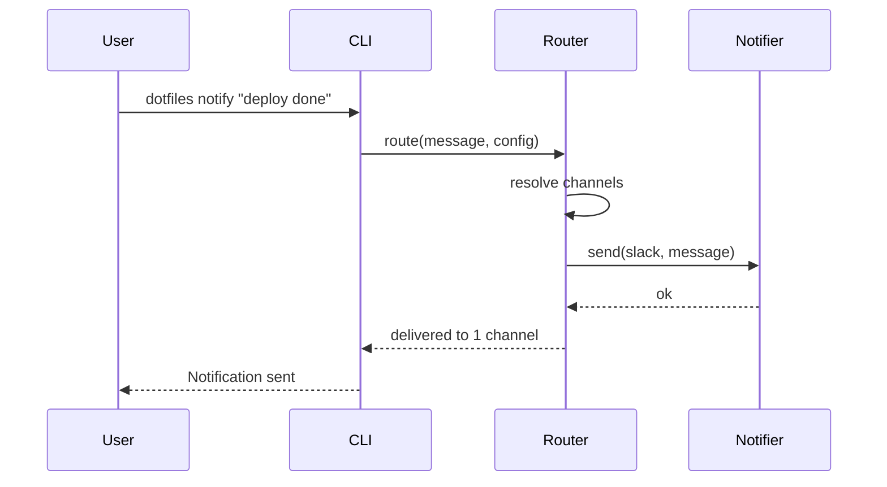
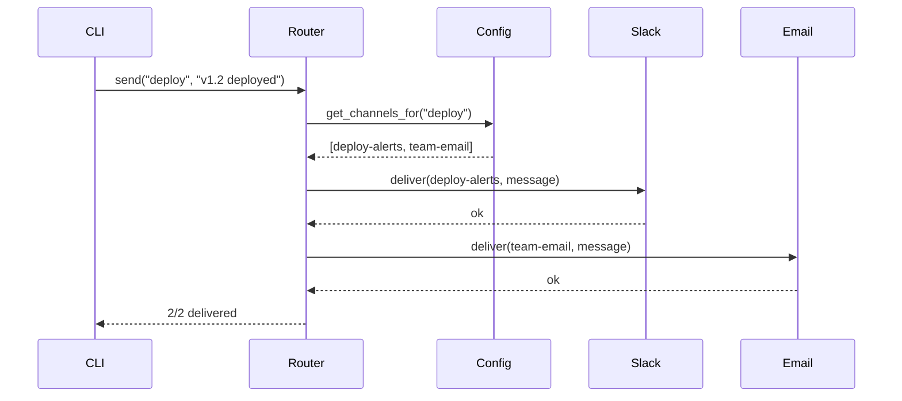

> Reference for: Spec Create
> Load when: Writing design document (Phase 2)

# Design Template

## Structure

````markdown
# <Feature Name> — Design

## Architecture Overview

[High-level system design, component relationships, how this feature fits into the existing system]

## Technical Decisions

### TD-1: <Decision Title>

**Choice**: [What was chosen]
**Alternatives considered**:
- [Alternative A] — rejected because [reason]
- [Alternative B] — rejected because [reason]

**Rationale**: [Why this choice is best for the current context]

### TD-2: <Decision Title>

...

## Implementation Considerations

### Data Model

[Schema changes, new types, state shape — only if applicable]

### API / Interface

[Public API, CLI interface, function signatures — whatever consumers interact with]

### Performance

[Anticipated bottlenecks, caching strategy, lazy loading — only if relevant]

### Security

[Input validation, auth checks, data exposure risks — only if relevant]

## Sequence Diagrams

[Critical flows visualized using Mermaid]
````

## Guidelines

### Architecture Overview

- Show where the feature fits in the existing system
- Identify which existing components are affected
- Call out new components/modules being introduced
- Keep it high-level — implementation details go in "Implementation Considerations"

### Technical Decisions

Use the "alternatives considered" pattern for every non-trivial decision:

1. State the decision clearly
2. List alternatives you evaluated
3. Explain why each alternative was rejected
4. State the rationale for the chosen approach

This creates a decision log that prevents re-debating settled questions.

### Sequence Diagrams

Use Mermaid syntax for visual flows:

````markdown

````

Only diagram flows that involve multiple components or non-obvious sequencing.

### Scope Guidance

| Belongs in Design | Belongs in Requirements | Belongs in Tasks |
|---|---|---|
| *How* to build it | *What* to build | *When* to build it |
| Component structure | User stories | Implementation order |
| Technology choices | Acceptance criteria | Status tracking |
| Data model | Non-functional requirements | Dependencies |
| API contracts | Out of scope | Verification method |

## Example

````markdown
# Notification Routing — Design

## Architecture Overview

The notification router sits between the CLI command layer and individual notifier
adapters. It reads a channel configuration, resolves which adapters to invoke,
and fans out the message.

Components:
- `NotificationRouter` — core orchestrator
- `ChannelConfig` — YAML-based channel definitions
- `SlackAdapter`, `EmailAdapter` — pluggable notifier implementations

## Technical Decisions

### TD-1: Configuration format

**Choice**: YAML file at `~/.config/notify/channels.yml`
**Alternatives considered**:
- JSON — rejected: harder to read/edit manually
- TOML — rejected: less common in this ecosystem, steeper learning curve
- Environment variables — rejected: can't express channel routing rules

**Rationale**: YAML balances human readability with structured data. Users already
edit YAML configs in this project (e.g., manifest.yml).

### TD-2: Adapter pattern for notifiers

**Choice**: Trait-based adapter pattern with runtime dispatch
**Alternatives considered**:
- Hardcoded if/else per channel — rejected: adding channels requires modifying router
- Plugin system with dynamic loading — rejected: over-engineered for 2-3 channels

**Rationale**: Simple trait implementation per channel. Adding a new channel means
one new struct + trait impl, no router changes.

## Implementation Considerations

### Data Model

Channel config shape:
```yaml
channels:
  - name: deploy-alerts
    type: slack
    webhook_url: ${SLACK_WEBHOOK}
    events: [deploy, rollback]
  - name: team-email
    type: email
    to: team@example.com
    events: [deploy]
```

### API / Interface

```
notify send <event> <message> [--channel <name>]
notify channels list
notify channels test <name>
```

### Security

- Webhook URLs stored in config file with `0600` permissions
- Support env var interpolation (`${VAR}`) to avoid secrets in plaintext

## Sequence Diagrams


````
