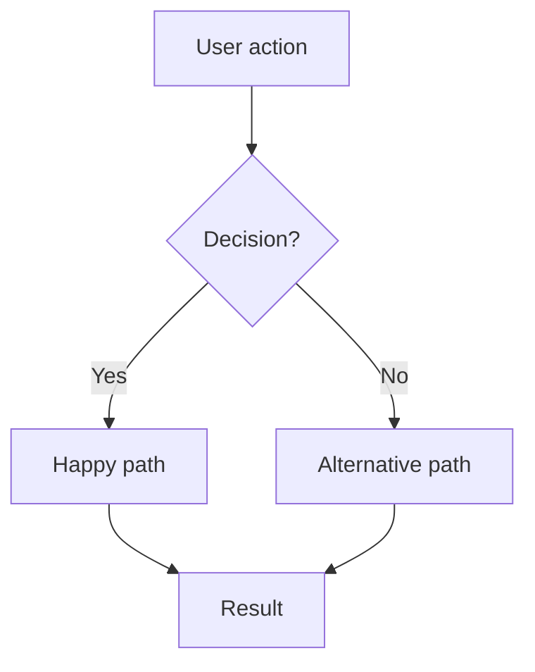
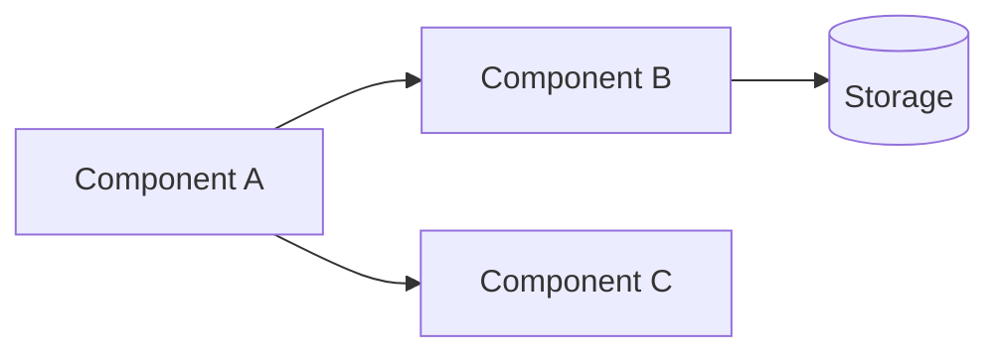
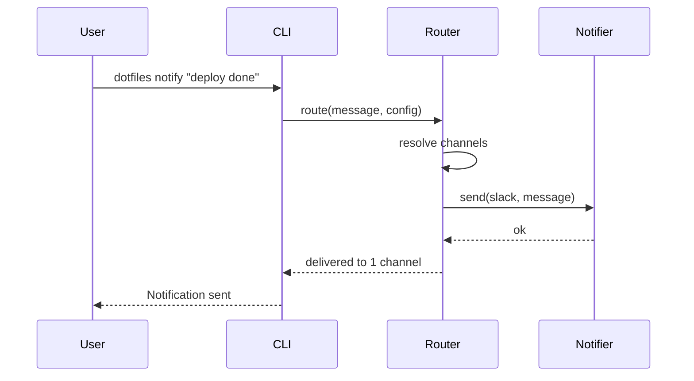

> Reference for: Spec Create
> Load when: Writing design document (Phase 2)

# Design Template

## Structure

Follow this skeleton exactly — every heading must appear in the output. The Example section below illustrates the structure with concrete content; do not copy example content into output.

````markdown
# <Feature Name> — Design

## Architecture Overview

[High-level system design, component relationships, how this feature fits into the existing system]

## Usage Flow



[Mermaid flowchart showing the user journey through the feature — from entry point to outcomes]

## Component Diagram



[Mermaid diagram showing system structure: components, their relationships, and data flow]

## Technical Decisions

### TD-1: <Decision Title>

**Choice**: [What was chosen]
**Alternatives considered**:
- [Alternative A] — rejected because [reason]
- [Alternative B] — rejected because [reason]

**Rationale**: [Why this choice is best for the current context]

### TD-2: <Decision Title>

...

## Implementation Considerations

### Data Model

[Schema changes, new types, state shape — only if applicable]

### API / Interface

[Public API, CLI interface, function signatures — whatever consumers interact with]

### Performance

[Anticipated bottlenecks, caching strategy, lazy loading — only if relevant]

### Security

[Input validation, auth checks, data exposure risks — only if relevant]

## Sequence Diagrams

[Critical flows visualized using Mermaid — focus on multi-component interactions]

## File Inventory

| File | Action | Purpose |
|------|--------|---------|
| `src/auth/service.ts` | new | Core authentication service |
| `src/auth/types.ts` | new | Type definitions for auth domain |
| `src/middleware/auth.ts` | modify | Add token validation middleware |
| `tests/auth/service.test.ts` | new | Unit tests for auth service |

[Complete list of files to create or modify. This is the primary input for spec-impl.]
````

## Guidelines

### Architecture Overview

- Show where the feature fits in the existing system
- Identify which existing components are affected
- Call out new components/modules being introduced
- Keep it high-level — implementation details go in "Implementation Considerations"

### Usage Flow

Mermaid `flowchart` showing the user journey:

- Start with the user's entry point (command, click, event)
- Show decision points and branching paths
- Include error/edge-case paths, not just the happy path
- End with observable outcomes

This helps developers and agents understand the feature's scope at a glance.

### Component Diagram

Mermaid `graph` showing system structure:

- Show components, services, and stores involved
- Arrow direction = dependency or data flow
- Include external systems the feature interacts with
- Use shapes to distinguish types: `[Service]`, `[(Database)]`, `([Queue])`

### Technical Decisions

Use the "alternatives considered" pattern for every non-trivial decision:

1. State the decision clearly
2. List alternatives you evaluated
3. Explain why each alternative was rejected
4. State the rationale for the chosen approach

TD-X IDs are referenced by tasks (`T-X` entries reference `TD-X` for traceability).

### Sequence Diagrams

Use Mermaid syntax for multi-component interaction flows:

````markdown

````

Only diagram flows that involve multiple components or non-obvious sequencing.

### File Inventory

List every file the feature will create or modify:

- **File**: path relative to project root
- **Action**: `new` or `modify`
- **Purpose**: one-line description of the file's role

This table is the primary input for spec-impl — it tells the implementing agent exactly which files to touch. File Inventory is the **source of truth** for file paths; task entries reference subsets of it. If paths change, update File Inventory first, then propagate to tasks.

### Scope Guidance

| Belongs in Design | Belongs in Requirements | Belongs in Tasks |
|---|---|---|
| *How* to build it | *What* to build | *When* to build it |
| Component structure | User stories | Implementation order |
| Technology choices | Acceptance criteria | Status tracking |
| Data model | Non-functional requirements | Dependencies |
| API contracts | Out of scope | Verification method |

## Example

See `references/example-design.md` for a full User Authentication design example. The same feature is used across `example-requirements.md` and `example-tasks.md` for end-to-end traceability.
