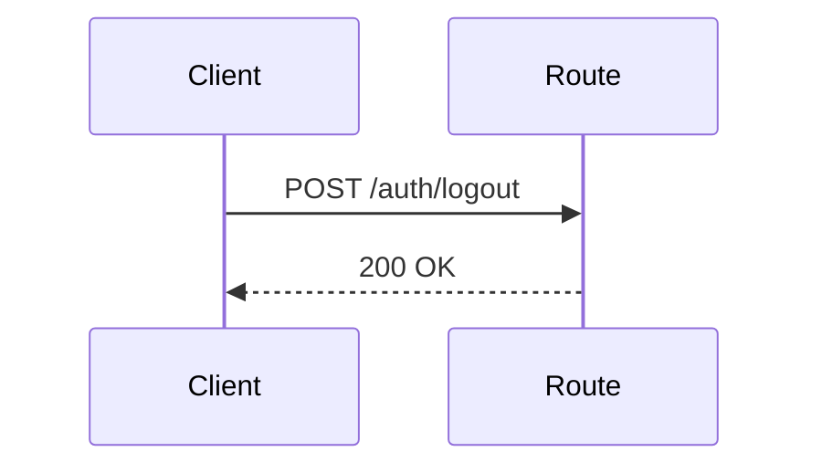
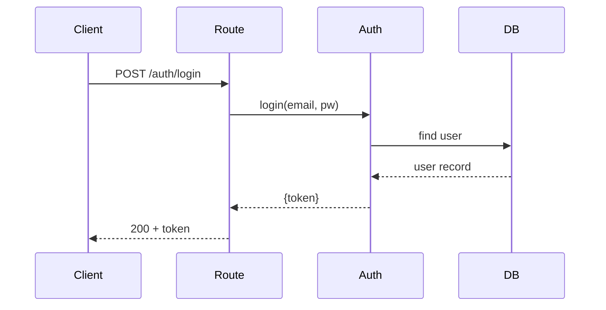
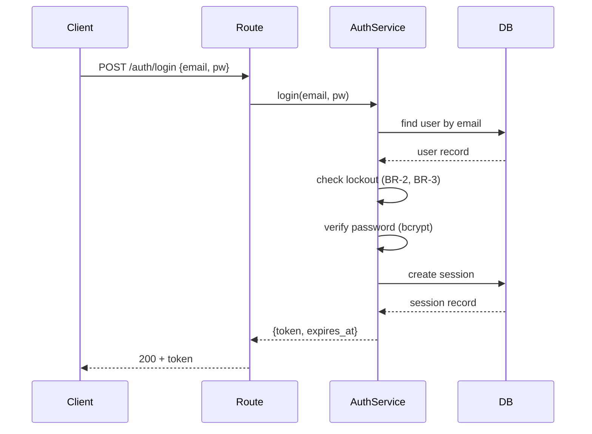

> Reference for: Spec Create
> Load when: Writing design (Phase 2) — need concrete good/bad examples

# Design: Do & Don't Examples

Side-by-side examples showing common mistakes and their corrections. Use alongside `design-template.md` for the formal rules. All examples use the User Authentication feature from `example-design.md`.

---

## Technical Decisions (TD-X)

### Bad: Decision with no alternatives

```markdown
### TD-1: Session storage

**Choice**: Database-backed sessions
**Rationale**: This is the best approach for our use case.
```

**Why it's wrong:** No alternatives considered means the decision can't be evaluated or revisited. "Best approach" is not a rationale — it's a conclusion without reasoning. An agent implementing this cannot understand the trade-offs.

### Bad: Decision that is not a decision

```markdown
### TD-1: We will use TypeScript

**Choice**: TypeScript
**Rationale**: The project already uses TypeScript.
```

**Why it's wrong:** Not a decision for this feature — the language is a pre-existing constraint, not a design choice. `TD-X` entries are decisions made specifically for this feature.

### Good: Decision with explicit alternatives and rationale

```markdown
### TD-1: Session storage

**Choice**: Database-backed sessions (`sessions` table)
**Alternatives considered**:
- JWT (stateless) — rejected: can't revoke tokens without a blocklist, which recreates server-side state
- Redis — rejected: adds infrastructure dependency for a low-traffic service

**Rationale**: DB sessions are simple, revocable, and use existing infrastructure.
```

**Why it's right:** An agent or reviewer can understand why Redis was rejected and therefore knows not to introduce it. If requirements change (high traffic), the decision can be revisited with the documented trade-off in hand.

---

## Sequence Diagrams

### Bad: Sequence diagram for a single-component operation

```markdown
## Sequence Diagrams


```

**Why it's wrong:** A logout with one participant and one response doesn't need a sequence diagram. Sequence diagrams are for flows involving 3+ components with non-obvious handoffs.

### Bad: Sequence diagram missing error path

```markdown

```

**Why it's wrong:** The happy path only. The diagram doesn't show what happens on wrong password, lockout, or DB failure. Agents implementing from this diagram won't know where error handling belongs.

### Good: Sequence diagram covering decision points

```markdown

```

**When to include a sequence diagram:** when a flow touches 3+ components or has non-obvious call ordering (e.g., lockout check must happen before password check). Omit for single-component operations.

---

## File Inventory

### Bad: File without purpose

```markdown
| File | Action | Purpose |
|------|--------|---------|
| `src/auth/service.ts` | new | |
| `src/auth/types.ts` | new | Types |
| `src/routes/auth.ts` | new | Routes |
```

**Why it's wrong:** Empty or one-word purposes ("Types", "Routes") tell an agent nothing. When implementing, the agent can't tell whether `service.ts` handles login only, or login + logout + lockout.

### Bad: File not touched by any task

```markdown
| File | Action | Purpose |
|------|--------|---------|
| `src/auth/service.ts` | new | AuthService |
| `src/auth/legacy-auth.ts` | modify | Update old auth |   ← no task references this
```

**Why it's wrong:** Every file in the inventory must appear in at least one task. Orphaned inventory entries mean untracked work.

### Good: Each file has a scoped, specific purpose

```markdown
| File | Action | Purpose |
|------|--------|---------|
| `migrations/add-auth-tables.sql` | new | Sessions table + user lockout columns |
| `src/auth/service.ts` | new | AuthService: login, logout, lockout logic |
| `src/auth/types.ts` | new | Auth domain types (Session, LoginRequest) |
| `src/auth/lockout.ts` | new | Lockout check and counter logic |
| `src/routes/auth.ts` | new | POST /auth/login, POST /auth/logout |
| `src/middleware/auth.ts` | new | Token extraction and session validation |
| `tests/auth/service.test.ts` | new | AuthService unit tests |
| `tests/auth/lockout.test.ts` | new | Lockout logic unit tests |
| `tests/auth/routes.test.ts` | new | Auth route integration tests |
```

**Why it's right:** Each file's purpose is scoped to its content. An agent can see that `lockout.ts` handles check+counter logic — separate from the session management in `service.ts`.

---

## Architecture Overview

### Bad: Implementation details in overview

```markdown
## Architecture Overview

Using bcrypt with cost 12 for password hashing, sessions stored in PostgreSQL with a UUID primary key and a `expires_at` timestamp. The lockout counter is stored in the `failed_login_count` column on the `users` table.
```

**Why it's wrong:** Schema details and library choices belong in Implementation Considerations, not the overview. The overview should describe components and their relationships, not the database columns.

### Good: Components and relationships only

```markdown
## Architecture Overview

Auth is implemented as a service layer between the API routes and the database.
The `AuthService` handles credential verification, session management, and lockout logic.
A middleware extracts and validates tokens on protected routes.

Components:
- `AuthService` — login, logout, session management, lockout
- `AuthMiddleware` — token extraction and validation on protected routes
- `sessions` table — stores active sessions with expiry
```

---

## Non-Functional Requirements

### Vague vs measurable NFRs

### Bad: NFR as vague aspiration

```markdown
## Non-Functional Requirements

- **NFR-1** (Performance): The system should be fast
- **NFR-2** (Security): The system should be secure
```

**Why it's wrong:** Vague NFRs can't be verified. "Fast" and "secure" mean different things to different people and give an implementing agent zero guidance on what to actually enforce.

### Good: NFR with measurable constraint

```markdown
## Non-Functional Requirements

- **NFR-1** (Performance): Login endpoint responds in under 200ms (p95)
- **NFR-2** (Security): Passwords must never be stored in plaintext; bcrypt with cost factor ≥ 12
```

**Why it's right:** Each NFR has a concrete, testable threshold. An agent or reviewer can verify compliance without ambiguity.

> **Note:** NFRs are engineering constraints that live in design.md, not requirements.md. They are validated at integration/review time, not per-task. KPIs (product outcomes like adoption rate, user satisfaction) belong in requirements.md.

---

## Quick Checklist

Before presenting design for approval:

- [ ] Every `TD-X` lists at least 2 alternatives with rejection reasons
- [ ] No `TD-X` is a pre-existing constraint (language, framework) rather than a feature decision
- [ ] Sequence diagrams only present for flows with 3+ components or non-obvious call ordering
- [ ] Every sequence diagram includes at least one error/decision branch
- [ ] Every file in File Inventory has a non-empty, scoped purpose
- [ ] Every file in File Inventory will appear in at least one task
- [ ] Architecture Overview describes components and relationships — no schema or library details
- [ ] Usage Flow diagram is a flowchart (user journey), not a sequence diagram
- [ ] Component Diagram shows structural relationships between system components
- [ ] NFR section present with measurable constraints
- [ ] NFRs are engineering constraints, not product KPIs
