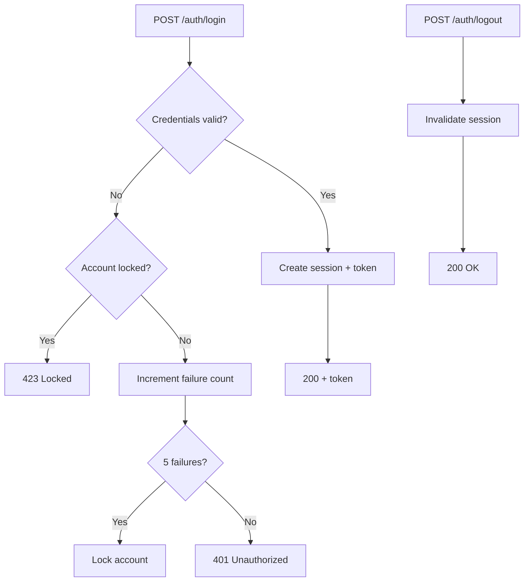
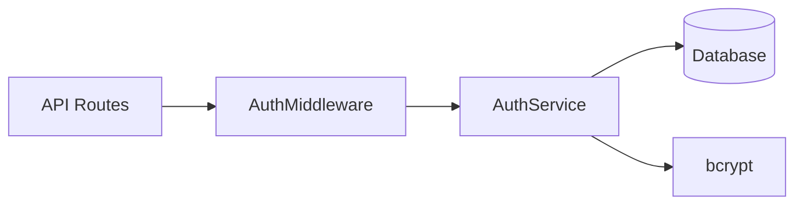
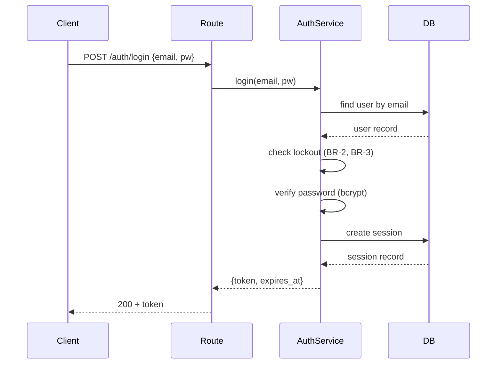

> Reference for: Spec Create
> Load when: Writing design (Phase 2) — need to see a completed example

# User Authentication — Design (Example)

This illustrates the structure defined in `design-template.md` with concrete content. Follow the structure; do not copy this content.

All three example files use the same feature so you can trace `US-X` → `TD-X` → `T-X` → `BR-X` end-to-end: see also `example-requirements.md` and `example-tasks.md`.

---

````markdown
# User Authentication — Design

## Architecture Overview

Auth is implemented as a service layer between the API routes and the database.
The `AuthService` handles credential verification, session management, and lockout logic.
A middleware extracts and validates tokens on protected routes.

Components:
- `AuthService` — login, logout, session management, lockout
- `AuthMiddleware` — token extraction and validation on protected routes
- `sessions` table — stores active sessions with expiry

## Usage Flow



## Component Diagram



## Technical Decisions

### TD-1: Session storage

**Choice**: Database-backed sessions (`sessions` table)
**Alternatives considered**:
- JWT (stateless) — rejected: can't revoke tokens without a blocklist, which recreates server-side state
- Redis — rejected: adds infrastructure dependency for a low-traffic service

**Rationale**: DB sessions are simple, revocable, and use existing infrastructure.

### TD-2: Service layer pattern

**Choice**: `AuthService` class encapsulating all auth logic
**Alternatives considered**:
- Inline logic in route handlers — rejected: untestable, duplicated lockout checks
- Separate services per concern (SessionService, LockoutService) — rejected: over-segmented for 3 operations

**Rationale**: Single service keeps related logic together. Easy to test with a mock DB.

## Implementation Considerations

### Data Model

```sql
CREATE TABLE sessions (
    id UUID PRIMARY KEY,
    user_id UUID NOT NULL REFERENCES users(id),
    token TEXT NOT NULL UNIQUE,
    expires_at TIMESTAMP NOT NULL,
    created_at TIMESTAMP DEFAULT NOW()
);

ALTER TABLE users ADD COLUMN failed_login_count INT DEFAULT 0;
ALTER TABLE users ADD COLUMN locked_until TIMESTAMP;
```

### API / Interface

```
POST /auth/login    { email, password } → { token, expires_at }
POST /auth/logout   (Authorization header) → 200
```

### Security

- Passwords verified with bcrypt (cost factor 12)
- Tokens are opaque UUIDs, not JWTs — no client-side decoding
- Auth middleware rejects expired sessions before reaching route handlers

## Sequence Diagrams



## File Inventory

| File | Action | Purpose |
|------|--------|---------|
| `migrations/add-auth-tables.sql` | new | Sessions table + user lockout columns |
| `src/auth/service.ts` | new | AuthService: login, logout, lockout logic |
| `src/auth/types.ts` | new | Auth domain types (Session, LoginRequest) |
| `src/auth/lockout.ts` | new | Lockout check and counter logic |
| `src/routes/auth.ts` | new | POST /auth/login, POST /auth/logout |
| `src/middleware/auth.ts` | new | Token extraction and session validation |
| `tests/auth/service.test.ts` | new | AuthService unit tests |
| `tests/auth/lockout.test.ts` | new | Lockout logic unit tests |
| `tests/auth/routes.test.ts` | new | Auth route integration tests |
````
